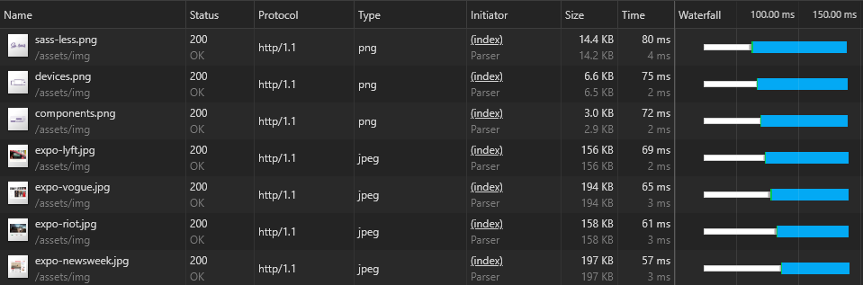
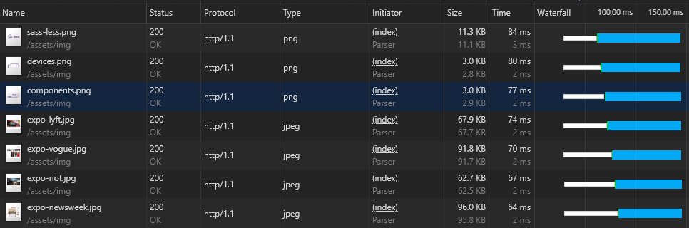
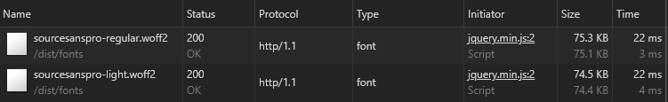
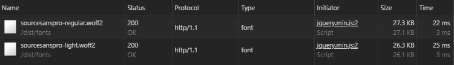

# Audit of the Bootstrap project
In this documenation you'll find the result of performance techniques that are applied to the Bootstrap project. Each section will have an audit that is taken before and after applying the technique.

## Images
The Bootstrap project consist of a couple images that have a file size around ~170 kb.

*before*

What we can do to increase performance is compressing the images. For this test, [compressjpgeg](http://compressjpeg.com/nl/) is used. Compressjpeg is a site where you're able to upload your files to the site and they compressed the images for you. After that you're able to download all of the files that you've uploaded.

The photo below is the audit after compressioning the images. As you can see the average size of the images are: ~80kb. That is a decrease of ~55%. 

*after*

### Conclusion

By compressioning the images you're able to decrease the overall size by ~55%. This is really big for mobile users that have limited data plan. However compressing images by uploading to Compressjpeg takes a lot of time. I suggest using an automatic tool like [compress-images](https://www.npmjs.com/package/compress-images) or else use this tool only if the overal size of the project is getting out of hand.

## Custom font

Bootstrap loads two fonts, both have a file size around ~75kb.

*before*

We can decrease the file by __subsetting__ the font.

>Regular Typotheque fonts support over 100 languages and advanced typographic features such as small caps, different numeral styles, alternative characters and special symbols. Web browsers, however, can access only a small fraction of those characters. Removing these inaccessible features makes the files much smaller, so they download much quicker. Users can specify which languages to support. - [Typotheque](https://www.typotheque.com/help/webfonts/what_is_font_subsetting)

The subsetting tool that used is: [FontSquirel](https://www.fontsquirrel.com/tools/webfont-generator). FontSquirel is a site where you can upload the font that you what to subset, and download the subset font when the process is done.

*after*

As you can see from the after photo, the file size is now ~27kb. A decrease of ~66%. That is enormous. However FontSquirel only process the subset font to the WOFF and WOFF2 format. Either way you're able to rely on the CSS fallback, where you try the subset format and if that's not working, than load the normal font.

### Conclusion
Subsetting your font can be a good idea to decrease file size. Subsetting is a one time process where the outcome can give a lot of benefit, although you're only able to have a WOFF and WOFF2 format. I recommend to add this process to future projects.

