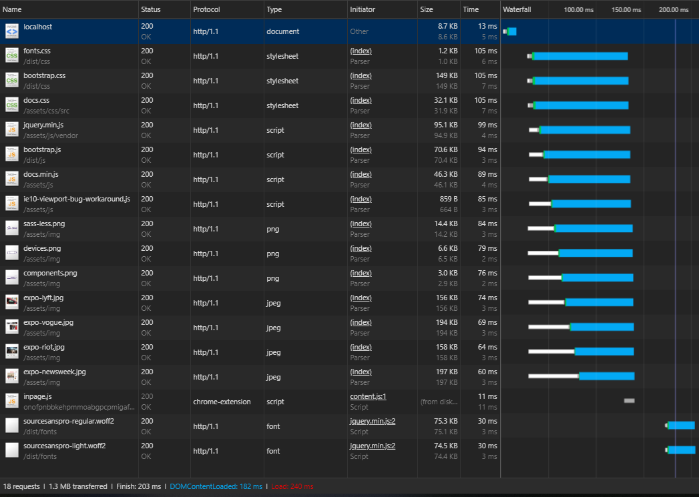

# Performance matters
This project serve as a testing ground for different optimalisation technique. Each technique has their own branch where the technique is applied to the project to see if there's a increase in performance. The master branche contain all of the techniques combined. 

The documentation for each technique can be found in the __AUDIT.md__ file.

The techniques are:

* Subsetting font
* Compress images
* Minify CSS
* G-Zip

## Result 

### Before

### After

As you can see from from the audit, we've managed to increase our performance by a significant amount.

|Description | Before | after | % Change |
|--|--|--|--|
|Performance | 64 | 86 | 34% |
|File size| 1.3 MB | 563 KB | 57 % |

By applying our performance techniques, we able to increase our performance score by 34% and decrease our overall file size by 57%. The file size is really significant for mobile users, because now, they don't have worry about exceeding their dataplan.

## Conclusion
If you're have the time and the budget than applying the performance technique can be really helpfull for increasing performance and decreasing the filesize. If your project focussed on mobile experience than I will say that applying optimalization techniques is a must, because with it, you are able to decrease the file size by 57%.

## Project setup

This project serves an adapted version of the [Bootstrap documentation website](http://getbootstrap.com/). It is based on the [github pages branche of Bootstrap](https://github.com/twbs/bootstrap/tree/gh-pages). 

Differences from actual Bootstrap documentation:

- Added custom webfont
- Removed third party scripts
- The src directory is served with [Express](https://expressjs.com/).
- Templating is done with [Nunjucks](https://mozilla.github.io/nunjucks/)

## Getting started

- Install dependencies: `npm install`
- Serve: `npm start`
- Expose localhost: `npm run expose`

## Wishlist
* [ ] Javascript minify
* [ ] Fix render blocking CSS